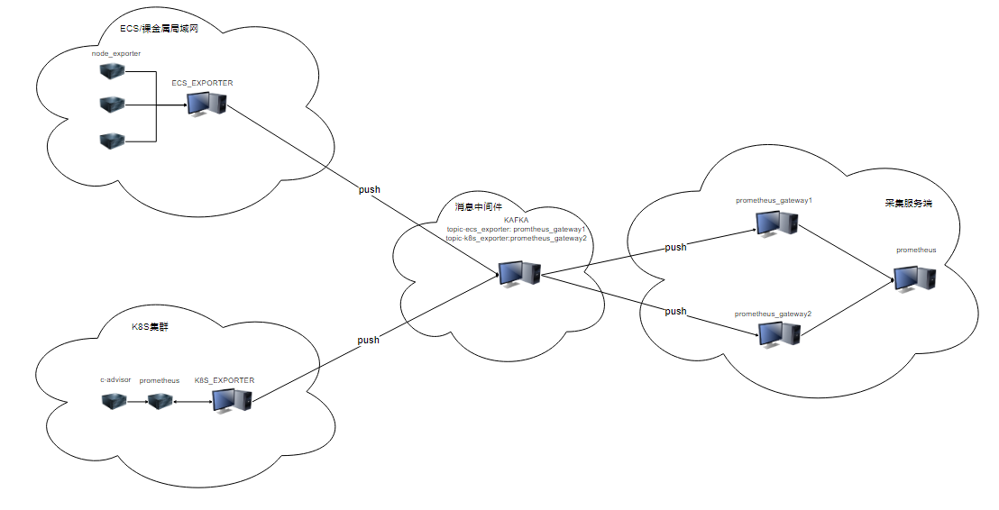

# 性能监控

## 1.背景

​		运维离不开监控，想知道自己的集群节点是否正常运行，监控必不可少，因此，基础设施的监控模块的开发任务迫在眉睫。

## 2.需求

​		当前运维监控主要有两种类型，华为云的ECS，CCE，裸金属。

​		对于ECS和裸金属，主要是通过node_exporter获取cpu，内存，硬盘总容量，硬盘使用容量；ecs_exporter去各个节点上获取数据，并通过nginx暴露给prometheus。

​		对于CCE，监控以容器为单位获取cpu, 内存，硬盘总容量，硬盘剩余容量；通过c-advisor对接prometheus，再通过prometheus的rewriter将数据导出到k8s_exporter，k8s_exporter再将数据通过nginx暴露给prometheus。

## 3.解决方案

​		

## 4.部署方案

ECS/裸金属:

​	node_exporter： 使用rpm包的方式进行安装。细配置文件见metrics/node_exporter文件夹。

​    ecs_exporter:  通过脚本进行安装。细配置文件见metrics/ecs_exporter文件夹。

​	nginx: 直接安装官方的软件。详细配置文件见nginx/ecs文件夹。

K8S集群:

​	prometheus： 在cce集群部署prometheus。详细配置文件见metrics/k8s_exporter/prometheus文件夹。

​	k8s_exporter： 在cce集群部署k8s_exporter。详细配置文件见metrics/k8s_exporter/k8s_exporter文件夹。

​	nginx: 直接安装官方的软件。详细配置文件见nginx/k8s文件夹。

服务点：

​	prometheus： 在cce集群中部署prometheus服务。详细配置文件见prometheus文件夹。
